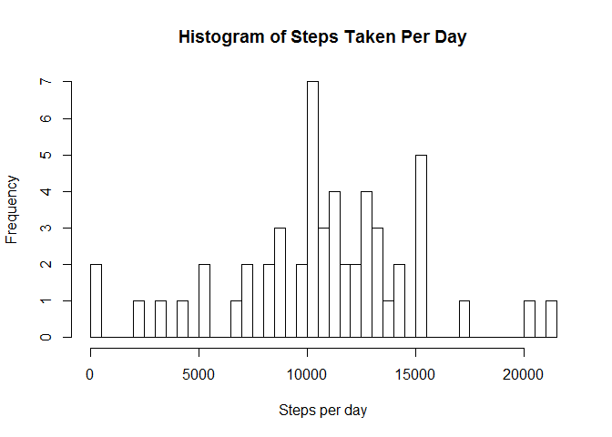
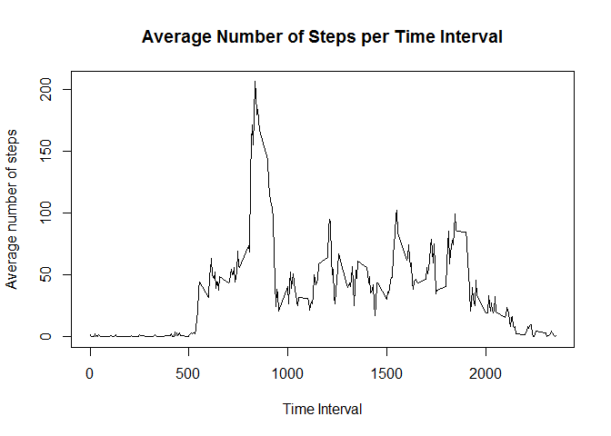
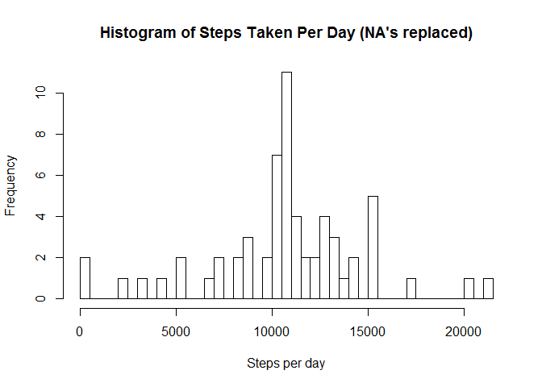
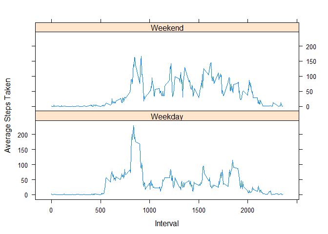

# Reproducible Research: Peer Assessment 1


## Loading and preprocessing the data
The following code reads in the data into our data frame 'activity'.

```r
activity <- read.csv("activity.csv")
```

Here I also created a subset of the data with the NA's removed:

```r
activity_noNA <- activity[!is.na(activity$steps),]
```


## What is mean total number of steps taken per day?
The following code creates a table (called 'date_sum') of the sum of the number of steps per day.

```r
library(plyr)
date_sum <- ddply(activity_noNA, .(date), summarize, sum_steps=sum(steps))
date_sum
```

```
##          date sum_steps
## 1  2012-10-02       126
## 2  2012-10-03     11352
## 3  2012-10-04     12116
## 4  2012-10-05     13294
## 5  2012-10-06     15420
## 6  2012-10-07     11015
## 7  2012-10-09     12811
## 8  2012-10-10      9900
## 9  2012-10-11     10304
## 10 2012-10-12     17382
## 11 2012-10-13     12426
## 12 2012-10-14     15098
## 13 2012-10-15     10139
## 14 2012-10-16     15084
## 15 2012-10-17     13452
## 16 2012-10-18     10056
## 17 2012-10-19     11829
## 18 2012-10-20     10395
## 19 2012-10-21      8821
## 20 2012-10-22     13460
## 21 2012-10-23      8918
## 22 2012-10-24      8355
## 23 2012-10-25      2492
## 24 2012-10-26      6778
## 25 2012-10-27     10119
## 26 2012-10-28     11458
## 27 2012-10-29      5018
## 28 2012-10-30      9819
## 29 2012-10-31     15414
## 30 2012-11-02     10600
## 31 2012-11-03     10571
## 32 2012-11-05     10439
## 33 2012-11-06      8334
## 34 2012-11-07     12883
## 35 2012-11-08      3219
## 36 2012-11-11     12608
## 37 2012-11-12     10765
## 38 2012-11-13      7336
## 39 2012-11-15        41
## 40 2012-11-16      5441
## 41 2012-11-17     14339
## 42 2012-11-18     15110
## 43 2012-11-19      8841
## 44 2012-11-20      4472
## 45 2012-11-21     12787
## 46 2012-11-22     20427
## 47 2012-11-23     21194
## 48 2012-11-24     14478
## 49 2012-11-25     11834
## 50 2012-11-26     11162
## 51 2012-11-27     13646
## 52 2012-11-28     10183
## 53 2012-11-29      7047
```
This code creates the histogram:

```r
hist(date_sum$sum_steps,breaks=50,freq=TRUE,xlab = "Steps per day", ylab = "Frequency", main = "Histogram of Steps Taken Per Day")
```

 

To calculate the mean of the number of steps taken each day:

```r
ddply(activity_noNA, .(date), summarize, mean_steps=mean(steps))
```

```
##          date mean_steps
## 1  2012-10-02  0.4375000
## 2  2012-10-03 39.4166667
## 3  2012-10-04 42.0694444
## 4  2012-10-05 46.1597222
## 5  2012-10-06 53.5416667
## 6  2012-10-07 38.2465278
## 7  2012-10-09 44.4826389
## 8  2012-10-10 34.3750000
## 9  2012-10-11 35.7777778
## 10 2012-10-12 60.3541667
## 11 2012-10-13 43.1458333
## 12 2012-10-14 52.4236111
## 13 2012-10-15 35.2048611
## 14 2012-10-16 52.3750000
## 15 2012-10-17 46.7083333
## 16 2012-10-18 34.9166667
## 17 2012-10-19 41.0729167
## 18 2012-10-20 36.0937500
## 19 2012-10-21 30.6284722
## 20 2012-10-22 46.7361111
## 21 2012-10-23 30.9652778
## 22 2012-10-24 29.0104167
## 23 2012-10-25  8.6527778
## 24 2012-10-26 23.5347222
## 25 2012-10-27 35.1354167
## 26 2012-10-28 39.7847222
## 27 2012-10-29 17.4236111
## 28 2012-10-30 34.0937500
## 29 2012-10-31 53.5208333
## 30 2012-11-02 36.8055556
## 31 2012-11-03 36.7048611
## 32 2012-11-05 36.2465278
## 33 2012-11-06 28.9375000
## 34 2012-11-07 44.7326389
## 35 2012-11-08 11.1770833
## 36 2012-11-11 43.7777778
## 37 2012-11-12 37.3784722
## 38 2012-11-13 25.4722222
## 39 2012-11-15  0.1423611
## 40 2012-11-16 18.8923611
## 41 2012-11-17 49.7881944
## 42 2012-11-18 52.4652778
## 43 2012-11-19 30.6979167
## 44 2012-11-20 15.5277778
## 45 2012-11-21 44.3993056
## 46 2012-11-22 70.9270833
## 47 2012-11-23 73.5902778
## 48 2012-11-24 50.2708333
## 49 2012-11-25 41.0902778
## 50 2012-11-26 38.7569444
## 51 2012-11-27 47.3819444
## 52 2012-11-28 35.3576389
## 53 2012-11-29 24.4687500
```
and the median.

```r
ddply(activity_noNA, .(date), summarize, median_steps=median(steps))
```

```
##          date median_steps
## 1  2012-10-02            0
## 2  2012-10-03            0
## 3  2012-10-04            0
## 4  2012-10-05            0
## 5  2012-10-06            0
## 6  2012-10-07            0
## 7  2012-10-09            0
## 8  2012-10-10            0
## 9  2012-10-11            0
## 10 2012-10-12            0
## 11 2012-10-13            0
## 12 2012-10-14            0
## 13 2012-10-15            0
## 14 2012-10-16            0
## 15 2012-10-17            0
## 16 2012-10-18            0
## 17 2012-10-19            0
## 18 2012-10-20            0
## 19 2012-10-21            0
## 20 2012-10-22            0
## 21 2012-10-23            0
## 22 2012-10-24            0
## 23 2012-10-25            0
## 24 2012-10-26            0
## 25 2012-10-27            0
## 26 2012-10-28            0
## 27 2012-10-29            0
## 28 2012-10-30            0
## 29 2012-10-31            0
## 30 2012-11-02            0
## 31 2012-11-03            0
## 32 2012-11-05            0
## 33 2012-11-06            0
## 34 2012-11-07            0
## 35 2012-11-08            0
## 36 2012-11-11            0
## 37 2012-11-12            0
## 38 2012-11-13            0
## 39 2012-11-15            0
## 40 2012-11-16            0
## 41 2012-11-17            0
## 42 2012-11-18            0
## 43 2012-11-19            0
## 44 2012-11-20            0
## 45 2012-11-21            0
## 46 2012-11-22            0
## 47 2012-11-23            0
## 48 2012-11-24            0
## 49 2012-11-25            0
## 50 2012-11-26            0
## 51 2012-11-27            0
## 52 2012-11-28            0
## 53 2012-11-29            0
```


## What is the average daily activity pattern?
For this section, I also used the data set 'activity_noNA', i.e. the data set with NA's removed.  The following code creates a plot of the average number of steps taken during each 5 minute time interval (0,5,10,...2355) for all days.

```r
interval_mn<-ddply(activity_noNA, .(interval), summarize,      mean_steps = mean(steps))
plot(interval_mn$interval, interval_mn$mean_steps,type="l",  main = "Average Number of Steps per Time Interval", xlab = "Time Interval",  ylab = "Average number of steps")
```

 

The time interval with the max average number of steps taken over all the days can be found with this code:

```r
interval_mn[interval_mn$mean_steps==max(interval_mn$mean_steps),]
```

```
##     interval mean_steps
## 104      835   206.1698
```
and it is the 5 minutes following 8:35 AM.


## Imputting missing values
The total number of NA's in the data set is 2304, found using the following code:

```r
sum(is.na(activity$steps))
```

```
## [1] 2304
```

I decided to replace the NA's with the average steps over all days for each interval. The following code creates a new data set ('new_activity') and replaces each NA value.

```r
new_activity <- activity
for (i in 1:length(new_activity$steps)){
     if (is.na(new_activity[i,1])){
          new_activity[i,1] <- interval_mn[interval_mn$interval==new_activity[i,3],2]
     }
}
```
We can check that it worked:

```r
head(activity)
```

```
##   steps       date interval
## 1    NA 2012-10-01        0
## 2    NA 2012-10-01        5
## 3    NA 2012-10-01       10
## 4    NA 2012-10-01       15
## 5    NA 2012-10-01       20
## 6    NA 2012-10-01       25
```

```r
head(new_activity)
```

```
##       steps       date interval
## 1 1.7169811 2012-10-01        0
## 2 0.3396226 2012-10-01        5
## 3 0.1320755 2012-10-01       10
## 4 0.1509434 2012-10-01       15
## 5 0.0754717 2012-10-01       20
## 6 2.0943396 2012-10-01       25
```

Here is the histogram of our data with the NA's replaced:

```r
new_date_sum <- ddply(new_activity, .(date), summarize, sum_steps=sum(steps))
hist(new_date_sum$sum_steps,breaks=50,freq=TRUE,xlab = "Steps per day", ylab = "Frequency", main = "Histogram of Steps Taken Per Day (NA's replaced)")
```

 

Replacing the NA's only changed the middle 3 ranges of the histogram.
Here are the new mean data for each day:

```r
ddply(new_activity, .(date), summarize, mean_steps=mean(steps))
```

```
##          date mean_steps
## 1  2012-10-01 37.3825996
## 2  2012-10-02  0.4375000
## 3  2012-10-03 39.4166667
## 4  2012-10-04 42.0694444
## 5  2012-10-05 46.1597222
## 6  2012-10-06 53.5416667
## 7  2012-10-07 38.2465278
## 8  2012-10-08 37.3825996
## 9  2012-10-09 44.4826389
## 10 2012-10-10 34.3750000
## 11 2012-10-11 35.7777778
## 12 2012-10-12 60.3541667
## 13 2012-10-13 43.1458333
## 14 2012-10-14 52.4236111
## 15 2012-10-15 35.2048611
## 16 2012-10-16 52.3750000
## 17 2012-10-17 46.7083333
## 18 2012-10-18 34.9166667
## 19 2012-10-19 41.0729167
## 20 2012-10-20 36.0937500
## 21 2012-10-21 30.6284722
## 22 2012-10-22 46.7361111
## 23 2012-10-23 30.9652778
## 24 2012-10-24 29.0104167
## 25 2012-10-25  8.6527778
## 26 2012-10-26 23.5347222
## 27 2012-10-27 35.1354167
## 28 2012-10-28 39.7847222
## 29 2012-10-29 17.4236111
## 30 2012-10-30 34.0937500
## 31 2012-10-31 53.5208333
## 32 2012-11-01 37.3825996
## 33 2012-11-02 36.8055556
## 34 2012-11-03 36.7048611
## 35 2012-11-04 37.3825996
## 36 2012-11-05 36.2465278
## 37 2012-11-06 28.9375000
## 38 2012-11-07 44.7326389
## 39 2012-11-08 11.1770833
## 40 2012-11-09 37.3825996
## 41 2012-11-10 37.3825996
## 42 2012-11-11 43.7777778
## 43 2012-11-12 37.3784722
## 44 2012-11-13 25.4722222
## 45 2012-11-14 37.3825996
## 46 2012-11-15  0.1423611
## 47 2012-11-16 18.8923611
## 48 2012-11-17 49.7881944
## 49 2012-11-18 52.4652778
## 50 2012-11-19 30.6979167
## 51 2012-11-20 15.5277778
## 52 2012-11-21 44.3993056
## 53 2012-11-22 70.9270833
## 54 2012-11-23 73.5902778
## 55 2012-11-24 50.2708333
## 56 2012-11-25 41.0902778
## 57 2012-11-26 38.7569444
## 58 2012-11-27 47.3819444
## 59 2012-11-28 35.3576389
## 60 2012-11-29 24.4687500
## 61 2012-11-30 37.3825996
```
This adds in the dates we lost in removing the NA's from the previous data.

This is the new median data:

```r
ddply(new_activity, .(date), summarize, median_steps=median(steps))
```

```
##          date median_steps
## 1  2012-10-01     34.11321
## 2  2012-10-02      0.00000
## 3  2012-10-03      0.00000
## 4  2012-10-04      0.00000
## 5  2012-10-05      0.00000
## 6  2012-10-06      0.00000
## 7  2012-10-07      0.00000
## 8  2012-10-08     34.11321
## 9  2012-10-09      0.00000
## 10 2012-10-10      0.00000
## 11 2012-10-11      0.00000
## 12 2012-10-12      0.00000
## 13 2012-10-13      0.00000
## 14 2012-10-14      0.00000
## 15 2012-10-15      0.00000
## 16 2012-10-16      0.00000
## 17 2012-10-17      0.00000
## 18 2012-10-18      0.00000
## 19 2012-10-19      0.00000
## 20 2012-10-20      0.00000
## 21 2012-10-21      0.00000
## 22 2012-10-22      0.00000
## 23 2012-10-23      0.00000
## 24 2012-10-24      0.00000
## 25 2012-10-25      0.00000
## 26 2012-10-26      0.00000
## 27 2012-10-27      0.00000
## 28 2012-10-28      0.00000
## 29 2012-10-29      0.00000
## 30 2012-10-30      0.00000
## 31 2012-10-31      0.00000
## 32 2012-11-01     34.11321
## 33 2012-11-02      0.00000
## 34 2012-11-03      0.00000
## 35 2012-11-04     34.11321
## 36 2012-11-05      0.00000
## 37 2012-11-06      0.00000
## 38 2012-11-07      0.00000
## 39 2012-11-08      0.00000
## 40 2012-11-09     34.11321
## 41 2012-11-10     34.11321
## 42 2012-11-11      0.00000
## 43 2012-11-12      0.00000
## 44 2012-11-13      0.00000
## 45 2012-11-14     34.11321
## 46 2012-11-15      0.00000
## 47 2012-11-16      0.00000
## 48 2012-11-17      0.00000
## 49 2012-11-18      0.00000
## 50 2012-11-19      0.00000
## 51 2012-11-20      0.00000
## 52 2012-11-21      0.00000
## 53 2012-11-22      0.00000
## 54 2012-11-23      0.00000
## 55 2012-11-24      0.00000
## 56 2012-11-25      0.00000
## 57 2012-11-26      0.00000
## 58 2012-11-27      0.00000
## 59 2012-11-28      0.00000
## 60 2012-11-29      0.00000
## 61 2012-11-30     34.11321
```
Since here we're just adding in data for the missing dates, the median should be the median of the interval means we calculated.

## Are there differences in activity patterns between weekdays and weekends?

The following code changes our existing dates to POSIXlt format, finds the weekdays corresponding to the dates, and then creates a new column in 'new_activity' called 'class' with classifications of weekend and weekday.

```r
#Changing to date format
dates <- strptime(new_activity$date,format="%Y-%m-%d")
#Labeling days
class <- weekdays(dates)
#Creating new column
new_activity$class<-class
#Renaming Weekends and Weekdays
new_activity[(new_activity$class=="Sunday"|new_activity$class=="Saturday"),4]<-"Weekend"
new_activity[!(new_activity$class=="Weekend"),4]<-"Weekday"
#Turning column into factors
new_activity$class<-factor(new_activity$class)
```

Here we average over all weekends and weekdays for each interval and the use the lattice system to plot:

```r
class_mn<-ddply(new_activity, .(interval,class), summarize, mean_steps = mean(steps))
library(lattice)
xyplot(mean_steps ~ interval | class, data=class_mn, type = "l",layout = c(1,2), ylab= "Average Steps Taken", xlab = "Interval")
```

 
